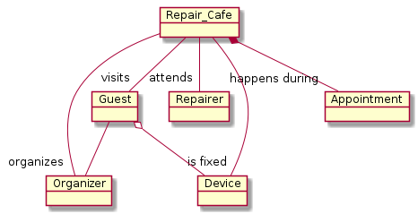
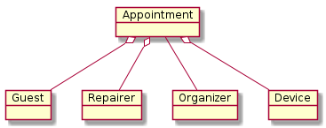
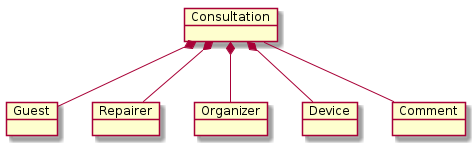
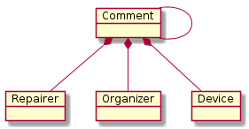

# Objects

A **device** is an object owned by a **guest** which has some issue. To get support for fixing the issue, a **guest** provides the information about the **device** and requests a repair **appointment** during a **repair_cafe**.

A **repair_cafe** happens at a specific date and location. It's an event which consists of **appointments** of **repairers** with **guests** to fix a **device**.

To organize a **repair_cafe**, a **organizer** needs to know which **repairer** will attend a **repair_cafe**, to schedule repair **appointments**.

In case of ambiguities, a **organizer** or a **repairer** can raise a **consultation** request. This **consultation** request is sent to the **guest** to get the needed information. In addition, a **organizer** or a **repairer** can add an **comment** to a **device**.

## Repair_Cafe

A **repair_cafe** is a event happening at a specific date at a specific location. During a **repair_cafe** **appointments** of **guests** with **repairers** happens to fix broken *devices*.

Field       | Type         | Description
-------------------------------------------------------------
location    | Char (200)   | location of the event
address     | Char (200)   | address where the event happens
event_date  | Date         | date when the event happens
repairer    | many to many | will attend the event

## Device

## Appointment

## Guest

## Repairer

## Organizer

## Consultation

## Comment