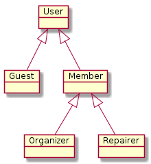

# Users

Repapp distinguishes two user categories.

A *guest* is a owner of an device. The *guest* is booking a repair appointment to get support from a repair café member to fix his device.

A *member* can be an *organizer* or a *repairer*. A *organizer* is taking care of arranging the repair assignments, and needs to access the private contact data of a guest to do this job. A *repairer* is supporting the *guest* in fixing his device. The *repairer* only needs the details of the device in advance, but not the private contact data of the guest.

