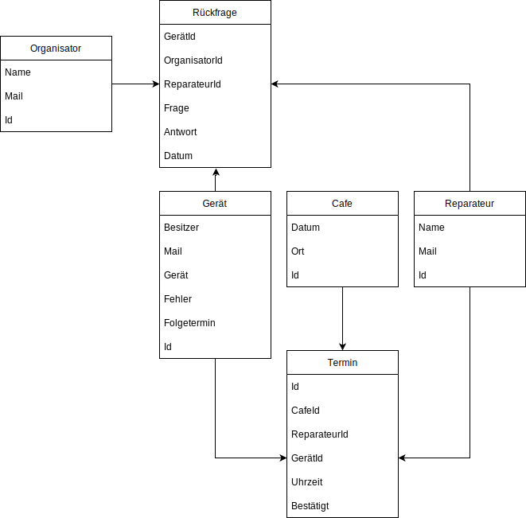

# Projekt RepApp

RepApp ist eine Web App um Reparaturen im Rahmen eines Repair-Cafés zu organisieren.

## Benutzer

### Gast

Ein Gast ist ein Gerätebesitzer der ein oder mehrere Geräte zur Reparatur anmelden möchte.

### Reparateur

Ein Reparateur ist ein Mitglied des Repair-Cafés der die Gerätebesitzer bei der Reparatur ihrer Geräte unterstützt.

### Organisator

Ein Organisator ist Mitglied des Repair-Cafés der die Termine mit den Gästen organisiert und die Reparateure zu den Geräten zuordnet.

## Use-Cases

### Gast

- Als Gast möchte ich einen Termin für eine Reparatur vereinbaren. Dafür Stelle ich Informationen zum Gerät und eine Fehlerbeschreibung zur Verfügung.
- Als Gast möchte ich eine Bestätigung für eine Reparaturanfrage bekommen.
- Als Gast möchte ich eine Terminbenachrichtigung oder eine Absage bekommen.
- Als Gast möchte ich mein angemeldetes Gerät und dessen Status einsehen können.
- Als Gast möchte ich Rückfragen zum Gerät empfangen und diese beantworten können.
- Als Gast möchte ich ein Gerät für eine Folgereparatur anmelden können

### Reparateur

- Als Reparateur möchte ich die angemeldeten Geräte ansehen können.
- Als Reparateur möchte ich mir ein angemeldetes Gerät zuordnen können.
- Als Reparateur möchte ich ein angemeldetes Gerät ablehnen können.
- Als Reparateur möchte ich Rückfragen zum Gerät stellen können.
- Als Reparateur möchte ich eine Benachrichtigung bekommen wenn eine Rückfrage beantwortet wird.
- Als Reparateur möchte ich eine Benachrichtigung bekommen wenn mir ein Gerät zugeordnet wird.
- Als Reparateur möchte ich mich für ein Repair-Café anmelden können.
- Als Reparateur möchte ich mich für ein Repair-Café abmelden können.

### Organisator

- Als Organisator möchte ich ein Café anmelden können.
- Als Organisator möchte ich die Terminanfragen einsehen können.
- Als Organisator möchte ich eine Rückfrage zu einer Terminanfrage stellen können.
- Als Organisator möchte ich eine Terminanfrage ablehnen können.
- Als Organisator möchte ich eine Terminanfrage zu einem Termin zuordnen können.
- Als Organisator möchte ich einen Terminanfrage zu einem Reparateur zuordnen können.

## Daten

### Cafe

Ein Cafe ist ein Repair-Café Termin.

Attribute:
- Datum: Datum der Veranstaltung
- Ort: Beschreibung wo das Repair-Café stattfindet

Technische Attribute:
- Id: Aufsteigende Nummer des Repair-Café

Annahmen:
- Ein Repair-Café beginnt um 13:00 Uhr.
- Ein Repair-Café hat drei aufeinanderfolgende Slots mit je einer Stunde

### Reparateur

Ein Reparateur ist ein Mitglied des Repair-Cafés das Gäste bei der Reparatur ihrer Geräte unterstützt.

Attribute:
- Name: Name des Reparateurs
- Mail: eMail-Adresse für Benachrichtigungen

Technische Attribute:
- Id: Aufsteigende Nummer des Reparateurs

Annahmen:
- Reparatuere sind immmer verfügbar, d.h. jeder Reparatuer wird zu einem neuen Repair-Café Termin automatisch hinzugefügt.
- Reparatuere können alles reparieren. Greäte Kategorien, Skills, ... können später hinzugefügt werden. 

### Organisator

Ein Organisator ist ein Mitglied des Repair-Cafés das Reparaturtermine mit den Gästen vereinbart.

Attribute:
- Name: Name des Organisators
- Mail: eMail-Adresse für Benachrichtigungen

Technische Attribute:
- Id: Aufsteigende Nummer des Organisators

### Gerät

Ein Gerät ist ein defekter Gegenstand der im Rahmen eines Repair-Cafés repariert werden soll.

Attribute:
- Besitzer: Name des Besitzers
- Mail: eMail-Adresse des Besitzers für Benachrichtigungen
- Gerät: Bezeichnung des Geräts
- Fehler: Beschreibung des Defekts
- Folgetermin: Boolesches Flag das anzeigt ob es sich um einen Folgetermin handelt.

Technische Attribute:
- Id: SHA256 Hash aus Gerät + Besitzer + Timestamp

Annahmen:
- Es gibt nur eine Geräteanmeldung pro Besitzer. Mehrere Geräte pro Besitzer kann später hinzugefügt werden.
- Für einen Folgetermin werden alle Daten neu eingegeben. Eine Folgereparatur auf Basis der ersten Anmeldung kann später hinzugefügt werden.

### Termin

Ein Termin ist eine Zuordnung von einem Gerät zu einem Zeitslot der Repair-Café Veranstaltung und einem Reparateur. Ein Termin ist bestätigt, wenn eine Organisator eine Termineinladung gesendet hat und er Gast diese bestätigt hat. 

Attribute:
- Uhrzeit: Uhrzeit des Termins
- Betätigt: Boolesches Flag. True wenn eine Einladung gesendet und bestätigt wurde.

Technische Attribute:
- Id: Aufsteigende Nummer des Termins
- CafeId: Referenz zum Cafe
- ReparateurId: Referenz um Reparateur oder NULL
- GerätId: Referenz zum Gerät

### Rückfrage

Eine Rückfrage ist eine Zuordnung von einem Gerät zu einem Organisator oder einem Reparateur.

Attribute:
- Frage: Frage zum Gerät oder Defekt
- Antwort: Antwort des Gastes
- Datum: Datum der Erstellung der Rückfrage

Technische Attribute:
- OrganisatorId: Referenz zum Organisator oder NULL
- ReparateurId: Referenz zum Reparateur oder NULL
- GerätId: Referenz zum Gerät

## Abläufe

## Ansichten

